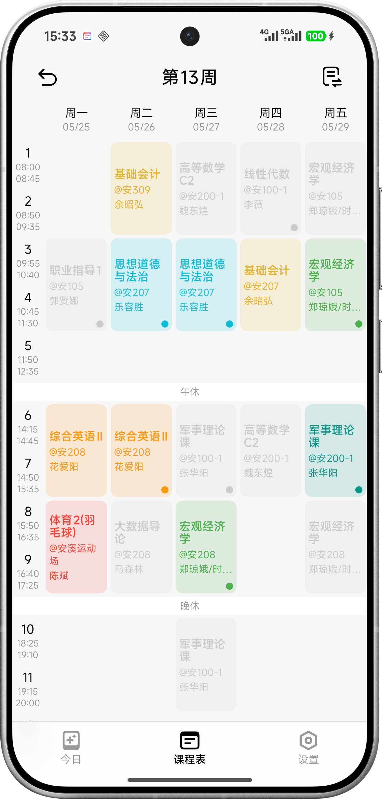
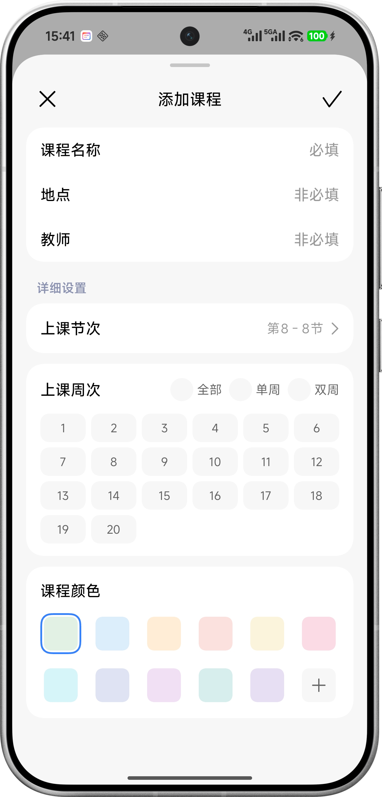
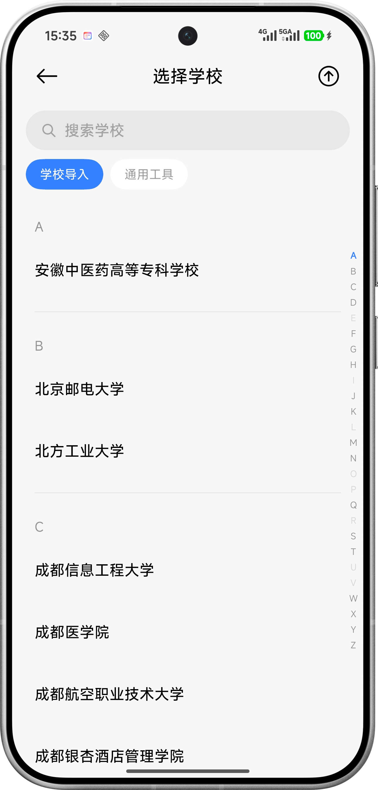
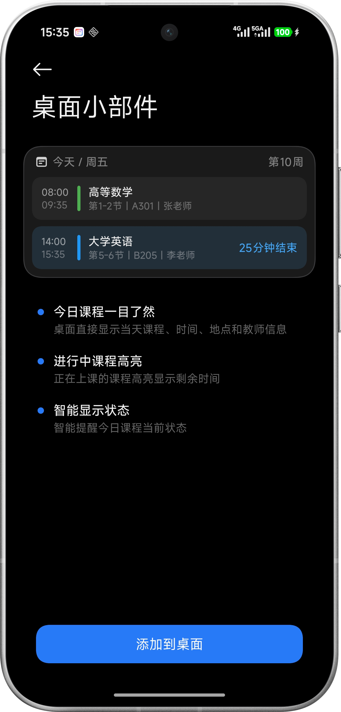

<div align="center">

# Nexio课程表

一款基于 Jetpack Compose 的 Android 课程表应用，支持教务系统导入、多格式课表导入、WebDAV 同步、桌面小组件等功能。

[](https://github.com/Hyper-schedule/hyper_schedule/stargazers)
[](https://github.com/Hyper-schedule/hyper_schedule/releases)
[](https://github.com/Hyper-schedule/hyper_schedule/releases/latest)

#### 一起交流与讨论 [QQ频道](https://pd.qq.com/s/cfwkl5q9q?b=9)

</div>

## 功能特性

**课表视图**
- 周视图课程表，支持多周快速切换与跳转
- 今日课程页面，展示当天课程列表及当前/下一节课信息
- 课程详情弹窗，查看完整课程信息
- 周末显示设置（不显示 / 仅周六 / 仅周日 / 周六与周日）

**课程管理**
- 添加、编辑、删除课程
- 支持自定义课程颜色
- 支持全周、单周、双周及自定义周次
- 课表节数设置（上午/下午/晚上节数自定义）
- 课程时间设置（每节课起止时间自定义）

**多课表管理**
- 多课表创建与切换
- 课表重命名、删除、分享
- 开启新学期（复用当前课表设置，创建空课程新课表）

**导入导出**
- 教务系统一键导入（WebView + JavaScript 脚本适配）
- AI 文本导入（自然语言格式自动解析）
- 课表文件导入（JSON / ICS / 拾光课程表格式）
- 课表导出（JSON 格式完整数据导出）

**排班课表**
- 排班模式：多课表对比查看排班情况

**课程提醒**
- 课前提醒通知
- 次日课程提醒
- 超级岛 / 灵动岛通知展示（需 Shizuku 特权）

**桌面小组件**
- 课程预览小组件
- 今日课程小组件

**数据同步**
- WebDAV 云端备份与恢复

**个性化**
- 壁纸搭配自定义（卡片模糊、透明度、高度、圆角）
- 深色模式适配
- 应用偏好设置（主题模式、首页默认页、应用风格）

**UI 特色**
- HyperOS3 风格 UI（基于 MiUiX 组件库）
- 液态玻璃（LiquidGlass）效果
- 连续曲率圆角（Squircle）裁剪
- 渐进模糊与平滑过渡动画
- 平板与小窗模式适配

## 预览界面

| 主课程表界面效果 | 添加/编辑课程页面 | 接入开源教务导入 | 桌面小部件及深色模式演示 |
|----------|----------|------------|----------|
|  |  |  |  |

## 项目结构

```
app/src/main/java/com/haooz/chedule/
├── ui/
│   ├── activities/            // Activity 页面
│   │   ├── MainActivity.kt           // 主页面 - 应用入口
│   │   ├── SwitchScheduleActivity.kt // 切换课程表
│   │   ├── EducationalImportActivity.kt  // 教务系统导入
│   │   ├── CourseTimeSettingsActivity.kt // 课程时间设置
│   │   ├── CourseReminderActivity.kt     // 课程提醒设置
│   │   ├── WebDavSettingsActivity.kt     // WebDAV 同步设置
│   │   ├── PreferenceSettingsActivity.kt // 偏好设置
│   │   ├── UpdateSettingsActivity.kt     // 应用更新设置
│   │   ├── AboutActivity.kt              // 关于页面
│   │   └── AppreciateAuthorActivity.kt   // 赞赏作者页面
│   ├── screens/               // Compose 页面
│   │   ├── SettingsScreen.kt     // 设置页（导入导出入口）
│   │   ├── AddCourseDialog.kt    // 添加/编辑课程
│   │   └── ShareImportDialog.kt  // 分享导入弹窗
│   ├── components/            // 通用组件
│   ├── theme/                 // 主题
│   └── web/                   // WebView 兼容
├── data/                      // 数据层
│   ├── Course.kt              // 课程数据模型
│   ├── CourseRepository.kt    // 课程数据仓库
│   ├── Combination.kt         // 壁纸组合数据
│   ├── SyncManager.kt         // 同步管理器
│   ├── WebDavManager.kt       // WebDAV 同步管理
│   └── school/                // 教务系统适配
├── viewmodel/                 // ViewModel
│   ├── CourseViewModel.kt     // 课程 ViewModel
│   ├── ScheduleViewModel.kt   // 多课表管理 ViewModel
│   └── SettingsViewModel.kt   // 设置 ViewModel
├── reminder/                  // 课程提醒
├── shizuku/                   // Shizuku 特权服务
├── effect/                    // 背景特效
└── widget/                    // 桌面小组件
```

## 技术栈

- **语言**: Kotlin
- **UI 框架**: Jetpack Compose + Material3
- **UI 组件**: [MiUiX](https://github.com/compose-miuix-ui/miuix)
- **圆角形状**: [Kyant Shapes](https://github.com/Kyant0/kyant-shapes)
- **数据存储**: SharedPreferences + Gson
- **网络同步**: WebDAV
- **脚本引擎**: Rhino (JavaScript)
- **最低支持**: Android 13 (API 33)

## 特别致谢

| 项目 | 作者 |
|------|------|
| [Miuix](https://github.com/compose-miuix-ui/miuix) | Yukonga |
| [Capsule](https://github.com/Kyant0/Capsule) | Kyant0 |
| [OkHttp](https://github.com/square/okhttp) | Square |
| [warehouse](https://github.com/XingHeYuZhuan/shiguang_warehouse) | XingHeYuZhuan |
| [Shizuku](https://github.com/RikkaApps/Shizuku) | RikkaApps |
| [Backdrop](https://github.com/Kyant0/AndroidLiquidGlass) | Kyant0 |


