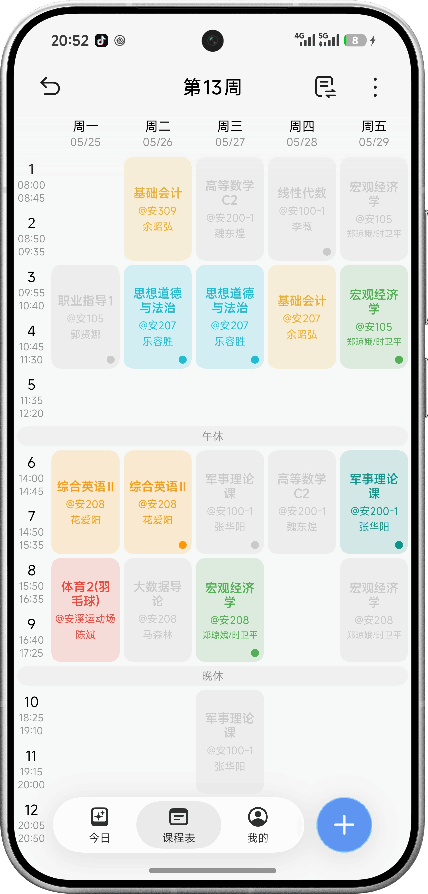
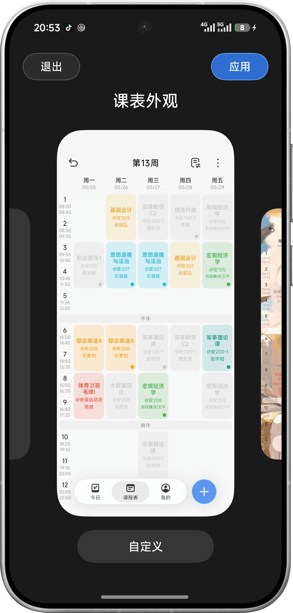
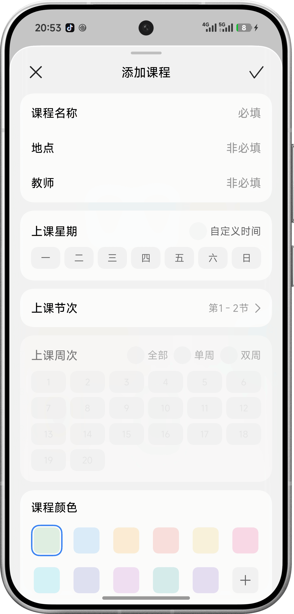
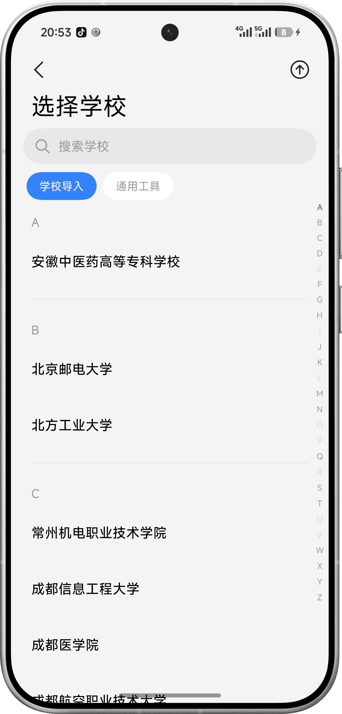
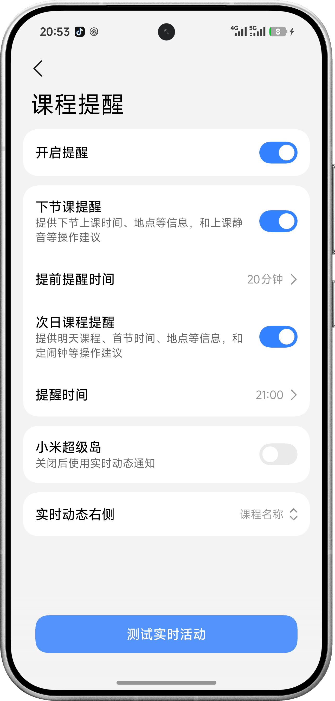
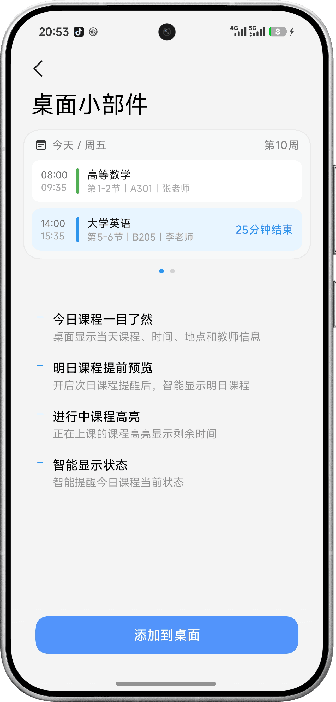

<div align="center">

# Nexio课程表

一款基于 Jetpack Compose 的 Android 课程表应用，支持自定义课表外观、教务系统导入、多格式课表导入、WebDAV 同步、桌面小组件等功能。

[](https://github.com/HaoZai000/NexioSchedule/stargazers)
[](https://github.com/HaoZai000/NexioSchedule/releases)
[](https://github.com/HaoZai000/NexioSchedule/releases/latest)

#### 一起交流与讨论 [QQ频道](https://pd.qq.com/s/cfwkl5q9q?b=9)

</div>

## 功能特性

**课表视图**
- 周视图课程表，支持多周快速切换与跳转
- 今日课程页面，展示当天课程列表及当前/下一节课信息
- 课程详情弹窗，查看完整课程信息
- 周末显示设置（不显示 / 仅周六 / 仅周日 / 周六与周日）

**课程管理**
- 添加、编辑、删除课程
- 支持自定义课程颜色
- 支持全周、单周、双周及自定义周次
- 课表节数设置（上午/下午/晚上节数自定义）
- 课程时间设置（每节课起止时间自定义）

**多课表管理**
- 多课表创建与切换
- 课表重命名、删除、分享
- 开启新学期（复用当前课表设置，创建空课程新课表）

**导入导出**
- 教务系统一键导入（WebView + JavaScript 脚本适配）
- AI 文本导入（自然语言格式自动解析）
- 课表文件导入（JSON / ICS / 拾光课程表格式）
- 课表导出（JSON 格式完整数据导出）

**排班课表**
- 排班模式：多课表对比查看排班情况

**课程提醒**
- 课前提醒通知
- 次日课程提醒
- 超级岛 / 灵动岛通知展示（需 Shizuku 特权）

**桌面小组件**
- 课程预览小组件
- 今日课程小组件

**数据同步**
- WebDAV 云端备份与恢复

**个性化**
- 壁纸搭配自定义（卡片模糊、透明度、高度、圆角）
- 深色模式适配
- 应用偏好设置（主题模式、首页默认页、应用风格）

**UI 特色**
- HyperOS4 风格 UI（基于 MiUiX 组件库）
- 液态玻璃（LiquidGlass）效果
- 连续曲率圆角（Squircle）裁剪
- 渐进模糊、边缘光效与平滑过渡动画
- 平板分屏模式适配

## 预览界面

| 主课程表 | 课表外观 | 添加课程 |
|----------|----------|----------|
|  |  |  |
| 教务导入 | 课程提醒 | 桌面小部件 |
|----------|----------|----------|
|  |  |  |

## 项目结构

```
app/src/main/java/com/haooz/chedule/
├── ui/
│   ├── activities/            // 各功能页面（Activity / Compose Screen）
│   │   ├── MainActivity.kt              // 主页面 - 应用入口
│   │   ├── SwitchScheduleActivity.kt    // 切换课程表
│   │   ├── EducationalImportActivity.kt // 教务系统导入
│   │   ├── CourseManageScreen.kt        // 课程管理
│   │   ├── CourseTimeSettingsScreen.kt  // 课程时间设置
│   │   ├── CourseReminderScreen.kt      // 课程提醒设置
│   │   ├── WebDavSettingsScreen.kt      // WebDAV 同步设置
│   │   ├── PreferenceSettingsScreen.kt  // 偏好设置
│   │   ├── AiImportScreen.kt            // AI 文本导入
│   │   ├── BackupAndMigrationScreen.kt  // 备份与迁移
│   │   ├── LocalBackupScreen.kt         // 本地备份
│   │   ├── ChangelogScreen.kt           // 更新日志
│   │   ├── UpdateSettingsScreen.kt      // 应用更新设置
│   │   ├── AboutActivity.kt             // 关于页面
│   │   ├── AppreciateAuthorScreen.kt    // 赞赏作者
│   │   └── WidgetIntroScreen.kt         // 小组件介绍
│   ├── screens/               // 核心 Compose 页面
│   │   ├── MainScheduleScreen.kt        // 周课表主界面
│   │   ├── TodayScreen.kt               // 今日课程
│   │   ├── TodayAssistant.kt            // 今日助手
│   │   ├── ShiftScheduleScreen.kt       // 排班课表
│   │   ├── CourseDetailScreen.kt        // 课程详情
│   │   ├── AddCourseDialog.kt           // 添加课程
│   │   ├── AddEditCourseBottomSheet.kt  // 添加/编辑课程 BottomSheet
│   │   ├── CourseEditScreen.kt          // 课程编辑
│   │   ├── CustomizeScheduleScreen.kt   // 课表外观自定义
│   │   ├── SchoolSelectionScreen.kt     // 学校选择
│   │   ├── TimeConfigEditScreen.kt      // 时间配置编辑
│   │   ├── SettingsScreen.kt            // 设置页
│   │   └── WebViewScreen.kt             // WebView 兼容
│   ├── components/           // 通用组件（TopBar / BottomBar / CourseCard / DayColumn / LiquidAddButton 等）
│   ├── basic/                 // 基础组件（渐隐顶栏 / 液态玻璃下拉菜单 / Overlay 弹窗 等）
│   ├── theme/                 // 主题（Color / Type / Theme）
│   ├── effects/               // 动效
│   │   ├── liquidglass/       // 液态玻璃
│   │   ├── miuix/             // MiUiX 特效
│   │   ├── edgelight/         // 边缘光效
│   │   └── background/        // HyperOS 背景特效
│   ├── web/                   // WebView 兼容与 JS 桥接
│   ├── data/                  // UI 层数据（更新日志 / 赞赏数据）
│   └── utils/                 // 工具（更新检查 / 主题工具 / 边缘滚动 等）
├── data/                      // 数据层
│   ├── Course.kt / TimeConfig.kt / Combination.kt / AppearanceConfig.kt
│   ├── CourseRepository.kt    // 课程数据仓库
│   ├── WebDavManager.kt       // WebDAV 同步管理
│   ├── SyncManager.kt         // 同步管理器
│   ├── StatsReporter.kt       // 统计上报
│   └── school/                // 教务系统适配（学校 / 脚本仓库）
├── viewmodel/                 // 状态管理
│   ├── CourseViewModel.kt     // 课程 ViewModel
│   ├── ScheduleViewModel.kt   // 多课表管理 ViewModel
│   ├── ShiftViewModel.kt      // 排班 ViewModel
│   └── SettingsViewModel.kt   // 设置 ViewModel
├── reminder/                  // 课程提醒（闹钟 / 通知 / 岛区跳转 / 组件事件接收器）
├── widget/                    // 桌面小组件（课程预览 / 今日课程，含 4x7 与标准尺寸）
├── shizuku/                   // Shizuku 特权服务
├── embedding/                 // 平板分屏适配（WindowInitializer）
```

## 技术栈

- **语言**: Kotlin
- **UI 框架**: Jetpack Compose + Material3
- **UI 组件**: [MiUiX](https://github.com/compose-miuix-ui/miuix)
- **圆角形状**: [Kyant Shapes](https://github.com/Kyant0/kyant-shapes)
- **数据存储**: SharedPreferences + Gson
- **网络同步**: WebDAV
- **脚本引擎**: Rhino (JavaScript)
- **最低支持**: Android 12 (API 31)

## 特别致谢

| 项目 | 作者 |
|------|------|
| [Miuix](https://github.com/compose-miuix-ui/miuix) | Yukonga |
| [Capsule](https://github.com/Kyant0/Capsule) | Kyant0 |
| [OkHttp](https://github.com/square/okhttp) | Square |
| [warehouse](https://github.com/XingHeYuZhuan/shiguang_warehouse) | XingHeYuZhuan |
| [Shizuku](https://github.com/RikkaApps/Shizuku) | RikkaApps |
| [Backdrop](https://github.com/Kyant0/AndroidLiquidGlass) | Kyant0 |


